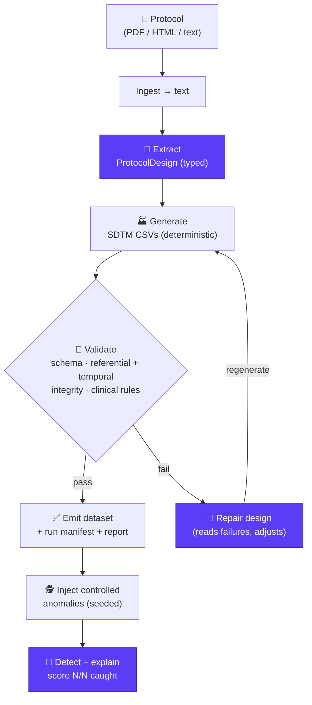

# protocol-to-data

> **From a clinical trial protocol to an analyzable synthetic dataset — in one agentic loop, driven by Claude.**

A researcher, clinical data manager, or biotech engineer drops in a study protocol
(PDF / HTML / text). Claude reads it, extracts the trial design, generates a
statistically realistic **SDTM/CDASH-shaped synthetic dataset**, validates it,
and (optionally) injects controlled data-quality anomalies so a downstream agent
can find and explain them.

No real patient data. No manual schema wiring. Just: **protocol in → analyzable data out.**

Built for **[Built with Claude: Life Sciences](https://cerebralvalley.ai/e/built-with-claude-life-sciences)**
(Cerebral Valley × Anthropic × Gladstone Institutes, July 7–13, 2026) — **Development Track**.

---

## The magic moment

```
$ ptd run examples/sample_protocol.md --subjects 40 --seed 42

🧬  Reading protocol ................ CARDIO-HF Phase 3, 2 arms, 8 visits
🧩  Extracting design ............... 3 endpoints, population n≈40, 12 SDTM domains
🏭  Generating synthetic data ...... DM VS AE LB QS EX  (2,140 records)
🔎  Validating ..................... 0 schema errors, 0 pre-dose AEs
✅  Dataset ready → data/output/CARDIO-HF/synthetic_data/
```

Each step is narrated by Claude with its reasoning visible — that is the demo.

---

## Why this fits the hackathon

- **Development Track**: a practical tool for researchers/clinics/biotech, built with Claude Code.
- **Agentic**: Claude is the orchestrator, not a bolt-on — it extracts, decides domains, generates, self-validates, and repairs.
- **Life-sciences native**: SDTM/CDASH clinical domains, realistic clinical logic.
- **Safe & shareable**: 100% synthetic, no PHI, reproducible with `--seed`.

See [`docs/IDEA.md`](docs/IDEA.md) for the full pitch and [`docs/BUILD_PLAN.md`](docs/BUILD_PLAN.md) for the 7-day plan.

---

## Quickstart

```bash
python -m venv venv && source venv/bin/activate
pip install -r requirements.txt
export ANTHROPIC_API_KEY=sk-ant-...

# End-to-end loop on the bundled example
python cli.py run examples/sample_protocol.md --subjects 20 --seed 42

# Individual steps
python cli.py extract examples/sample_protocol.md          # protocol → design.json
python cli.py generate design.json --subjects 20           # design → CSVs
python cli.py validate data/output/<study>/                # schema + clinical checks
python cli.py anomalies data/output/<study>/ --inject 5    # inject + detect loop
```

## Web UI

Prefer a browser? A thin Gradio front-end wraps the same loop:

```bash
python app.py           # then open http://127.0.0.1:7860
```

Upload a protocol (or use the bundled sample), set subjects/seed/anomalies, and watch the
extract → generate → validate → **repair** loop stream live, then browse the generated SDTM
CSVs and the anomaly scorecard. The UI reuses `run_loop` unchanged — it's presentation only.


## 🚀 Quickstart (Docker)

Run the whole app — web UI included — with one command, no local Python setup:

```bash
cp .env.example .env      # then add your ANTHROPIC_API_KEY
docker compose up         # or:  podman-compose up
```

Then open **http://localhost:7860**. The image installs dependencies, runs as a non-root
user, and reads your API key from `.env` at runtime (it is never baked into the image). The
compose file is engine-agnostic, so Podman users can substitute `podman-compose up`. Rebuild
after code changes with `docker compose up --build`.

## Architecture (one loop)



> Purple = Claude-driven reasoning (extract · repair · detect); the rest is deterministic
> Python. The **repair edge** is what makes it an agent, not a pipeline.

Full design: [`docs/ARCHITECTURE.md`](docs/ARCHITECTURE.md) ·
Spec: [`docs/SPEC.md`](docs/SPEC.md) ·
Skill: [`.claude/skills/protocol-to-data/SKILL.md`](.claude/skills/protocol-to-data/SKILL.md)

## Status

✅ **Complete and demo-ready.** Extraction, generation (therapeutic-area-aware,
dictionary-coded, referentially-sound), self-repair, and anomaly detection all work
end-to-end, with a full offline test suite and CI. See
[`docs/SUBMISSION.md`](docs/SUBMISSION.md) and [`docs/BUILD_PLAN.md`](docs/BUILD_PLAN.md).

## 🤝 Contributing

PRs welcome. Every push and pull request runs the **GitHub Actions CI**
([`.github/workflows/ci.yml`](.github/workflows/ci.yml)), which must pass before review:

1. **`ruff check .`** — code quality / lint
2. **`pytest`** — the full offline test suite (schemas, generation, referential + temporal
   integrity, dictionary coding, validation, the repair loop, and anomaly detection). No API
   key required — all LLM calls are mocked.

Please run both locally before opening a PR:

```bash
pip install ruff pytest
ruff check .
pytest -q
```

## License

MIT — see [`LICENSE`](LICENSE).
