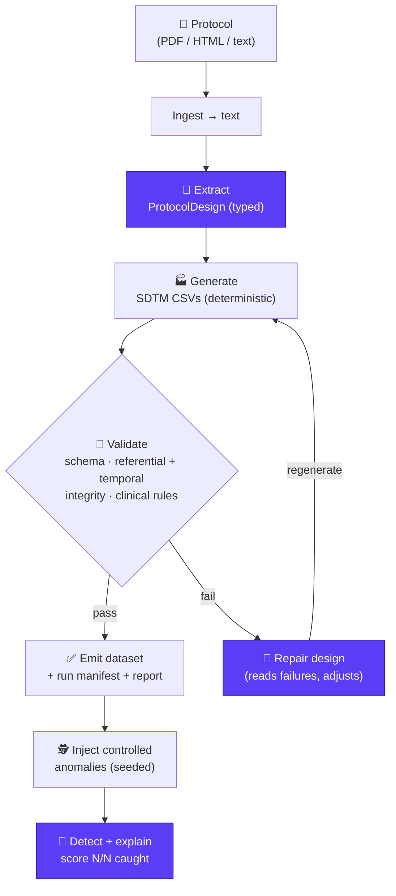

# protocol-to-data

> **From a clinical trial protocol to an analyzable synthetic dataset — in one agentic loop, driven by Claude.**

**🔗 Live demo → [protocol-to-data.onrender.com](https://protocol-to-data.onrender.com)** &nbsp;·&nbsp; _free tier — first load takes ~30–60 s to wake, then it's instant._

A researcher, clinical data manager, or biotech engineer drops in a study protocol
(PDF / HTML / text). Claude reads it, extracts the trial design, and a deterministic engine
generates a **therapeutic-area-aware, dictionary-coded, referentially-sound SDTM dataset** —
validated, self-repaired on failure, and (optionally) stress-tested by a second agent that
injects and detects data-quality defects.

No real patient data. No manual schema wiring. Just: **protocol in → analyzable data out** —
as **Databricks-ready Parquet, before an EDC is ever stood up.**

Built for **[Built with Claude: Life Sciences](https://cerebralvalley.ai/e/built-with-claude-life-sciences)**
(Cerebral Valley × Anthropic × Gladstone Institutes, July 7–13, 2026) — **Build Track**.

---

## The magic moment

```
$ ptd run examples/sample_protocol.md --subjects 40 --seed 42 --anomalies 5

🧬  Reading protocol ...
🧩  Extracting design (Claude) ...       → CARDIO-HF-P3: 2 arms, 6 visits, 6 endpoints, 7 domains
🏭  Generating synthetic data ...
    🔗  Integrity verified — no orphan USUBJID / VISITNUM before write
🔎  Validating ...                       ⚠️  FAIL — planned domain EG has no generated data
🔧  Repairing (Claude, attempt 1/2) ...  → design adjusted
🔎  Validating ...                       ✅  PASS — 0 errors across 6 planned domains
🎯  Claude caught 5/5 injected anomalies
🪙  Run cost: $0.29 · 23,870 in / 6,458 out
```

Every step is narrated by Claude with its reasoning visible — the **self-repair** loop (Claude
reads its own validation failure and fixes the design) is what makes it an agent, not a pipeline.

---

## What's under the hood

Hybrid AI by design — **Claude reasons, deterministic Python generates**:

- 🧠 **Claude for reasoning only** — extraction, self-repair, and anomaly detection. It never
  writes a data row, so it can't hallucinate structural data. (`generate.py` has zero LLM coupling.)
- 🏭 **Therapeutic-area-aware generation** — a cardiology profile (NT-proBNP/KCCQ/NYHA) and an
  oncology/NSCLC profile (hematology/chem/coag/thyroid + PK, QLQ-C30/LC13 + EQ-5D-5L, arm-exact
  dosing, RECIST) selected deterministically from the protocol's indication.
- 🔤 **Dictionary-coded SDTM** — `AEDECOD` (MedDRA) and `CMDECOD` (WHODrug) via a deterministic
  `code_term` mapper ("bad headache" → "Headache", "lasix" → "Furosemide").
- 🔗 **Referential + temporal integrity** — orphan `USUBJID` dropped and asserted; `VISIT↔VISITNUM`
  asserted 1:1 across VS/LB/QS/RS — a verify-before-write gate.
- 🕵️ **Anomaly loop** — a second Claude agent finds and explains injected defects, scored N/N.
- ⚡ **Semantic caching** — SHA-256-keyed extraction cache; an identical protocol never pays for
  extraction twice ($0 on a cache hit).
- 🪙 **Cost observability** — live per-run token + `$` tracking in the UI and CLI.
- 🔌 **MCP server** — `mcp_server.py` exposes extract / generate / validate as Model Context
  Protocol tools for Claude Desktop or any MCP client (`pip install ".[mcp]"`).
- 🔒 **PHI/PII sanitization** — opt-in (`PTD_SANITIZE_PHI=1`): deterministic regex + optional
  Presidio NER scrub the text **before** it reaches the LLM.
- 🗂️ **Run history · RBAC-aware · EDC-target-aware · Dockerized · CI-guarded** — enterprise seams
  without over-building. See [`docs/SUBMISSION.md`](docs/SUBMISSION.md) and
  [`docs/DEPLOY.md`](docs/DEPLOY.md) for the full story.

Safe & shareable: 100% synthetic, no PHI, reproducible with `--seed`.

---

## Quickstart

```bash
python -m venv venv && source venv/bin/activate
pip install -r requirements.txt
export ANTHROPIC_API_KEY=sk-ant-...

# End-to-end loop on the bundled example
python cli.py run examples/sample_protocol.md --subjects 20 --seed 42

# Individual steps
python cli.py extract examples/sample_protocol.md          # protocol → design.json
python cli.py generate design.json --subjects 20           # design → CSVs
python cli.py validate data/output/<study>/                # schema + clinical checks
python cli.py anomalies data/output/<study>/ --inject 5    # inject + detect loop
```

## Web UI

Prefer a browser? A thin Gradio front-end wraps the same loop:

```bash
python app.py           # then open http://127.0.0.1:7860
```

Upload a protocol (or use the bundled sample), set subjects/seed/anomalies, and watch the
extract → generate → validate → **repair** loop stream live, then browse the generated SDTM
CSVs and the anomaly scorecard. The UI reuses `run_loop` unchanged — it's presentation only.


## 🚀 Quickstart (Docker)

Run the whole app — web UI included — with one command, no local Python setup:

```bash
cp .env.example .env      # then add your ANTHROPIC_API_KEY
docker compose up         # or:  podman-compose up
```

Then open **http://localhost:7860**. The image installs dependencies, runs as a non-root
user, and reads your API key from `.env` at runtime (it is never baked into the image). The
compose file is engine-agnostic, so Podman users can substitute `podman-compose up`. Rebuild
after code changes with `docker compose up --build`.

## Architecture (one loop)



> Purple = Claude-driven reasoning (extract · repair · detect); the rest is deterministic
> Python. The **repair edge** is what makes it an agent, not a pipeline.

Full design: [`docs/ARCHITECTURE.md`](docs/ARCHITECTURE.md) ·
Spec: [`docs/SPEC.md`](docs/SPEC.md) ·
Skill: [`.claude/skills/protocol-to-data/SKILL.md`](.claude/skills/protocol-to-data/SKILL.md)

## Status

✅ **Complete and demo-ready.** Extraction, generation (therapeutic-area-aware,
dictionary-coded, referentially-sound), self-repair, and anomaly detection all work
end-to-end, with a full offline test suite and CI. See
[`docs/SUBMISSION.md`](docs/SUBMISSION.md) and [`docs/BUILD_PLAN.md`](docs/BUILD_PLAN.md).

## 🤝 Contributing

PRs welcome. Every push and pull request runs the **GitHub Actions CI**
([`.github/workflows/ci.yml`](.github/workflows/ci.yml)), which must pass before review:

1. **`ruff check .`** — code quality / lint
2. **`pytest`** — the full offline test suite (schemas, generation, referential + temporal
   integrity, dictionary coding, validation, the repair loop, and anomaly detection). No API
   key required — all LLM calls are mocked.

Please run both locally before opening a PR:

```bash
pip install ruff pytest
ruff check .
pytest -q
```

## License

MIT — see [`LICENSE`](LICENSE).
