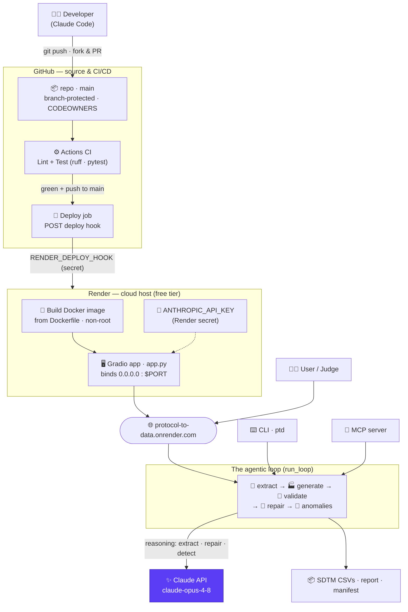
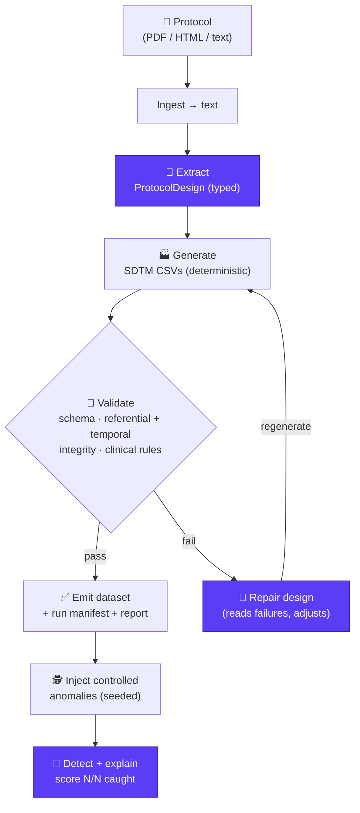

# protocol-to-data

> **From a clinical trial protocol to an analyzable synthetic dataset — in one agentic loop, driven by Claude.**

**🔗 Live demo → [protocol-to-data.onrender.com](https://protocol-to-data.onrender.com)** &nbsp;·&nbsp; _free tier — first load takes ~30–60 s to wake, then it's instant._

**🎥 Demo video → [youtu.be/JJXIagmZX3Q](https://youtu.be/JJXIagmZX3Q)** &nbsp;·&nbsp; _2.5-min walkthrough: protocol PDF → live agentic loop → SDTM data → Data Copilot chart._

A researcher, clinical data manager, or biotech engineer drops in a study protocol
(PDF / HTML / text). Claude reads it, extracts the trial design, and a deterministic engine
generates a **therapeutic-area-aware, dictionary-coded, referentially-sound SDTM dataset** —
validated, self-repaired on failure, and (optionally) stress-tested by a second agent that
injects and detects data-quality defects.

No real patient data. No manual schema wiring. Just: **protocol in → analyzable data out** —
as **Databricks-ready Parquet, before an EDC is ever stood up.**

Built for **[Built with Claude: Life Sciences](https://cerebralvalley.ai/e/built-with-claude-life-sciences)**
(Cerebral Valley × Anthropic × Gladstone Institutes, July 7–13, 2026) — **Build Track**.

---

## The magic moment

```
$ ptd run examples/sample_protocol.md --subjects 40 --seed 42 --anomalies 5

🧬  Reading protocol ...
🧩  Extracting design (Claude) ...       → CARDIO-HF-P3: 2 arms, 6 visits, 6 endpoints, 7 domains
🏭  Generating synthetic data ...
    🔗  Integrity verified — no orphan USUBJID / VISITNUM before write
🔎  Validating ...                       ⚠️  FAIL — planned domain EG has no generated data
🔧  Repairing (Claude, attempt 1/2) ...  → design adjusted
🔎  Validating ...                       ✅  PASS — 0 errors across 6 planned domains
🎯  Claude caught 5/5 injected anomalies
🪙  Run cost: $0.29 · 23,870 in / 6,458 out
```

Every step is narrated by Claude with its reasoning visible — the **self-repair** loop (Claude
reads its own validation failure and fixes the design) is what makes it an agent, not a pipeline.

---

## What's under the hood

Hybrid AI by design — **Claude reasons, deterministic Python generates**:

- 🧠 **Claude for reasoning only** — extraction, self-repair, and anomaly detection. It never
  writes a data row, so it can't hallucinate structural data. (`generate.py` has zero LLM coupling.)
- 🏭 **Therapeutic-area-aware generation** — a cardiology profile (NT-proBNP/KCCQ/NYHA) and an
  oncology/NSCLC profile (hematology/chem/coag/thyroid + PK, QLQ-C30/LC13 + EQ-5D-5L, arm-exact
  dosing, RECIST) selected deterministically from the protocol's indication.
- 🔤 **Dictionary-coded SDTM** — `AEDECOD` (MedDRA) and `CMDECOD` (WHODrug) via a deterministic
  `code_term` mapper ("bad headache" → "Headache", "lasix" → "Furosemide").
- 🔗 **Referential + temporal integrity** — orphan `USUBJID` dropped and asserted; `VISIT↔VISITNUM`
  asserted 1:1 across VS/LB/QS/RS — a verify-before-write gate.
- 🕵️ **Anomaly loop** — a second Claude agent finds and explains injected defects, scored N/N.
- 💬 **Data Copilot** — chat with the generated SDTM data in plain English (and **plot it**:
  bar / pie / line / scatter). Claude writes a **DuckDB** query that runs *directly on the on-disk
  CSVs* (streamed, never loaded into pandas), so it stays within the 512 MB cloud tier. Sandboxed
  for the demo (≤150 chars, 3 queries/run, SQL safety net).
- 🏛️ **Registry Cross-Check** — an NCT id is **auto-detected** from the protocol text and the
  extracted design is compared, read-only, against **ClinicalTrials.gov** (phase / arms /
  enrollment). Verify-before-trust; it never feeds generation.
- 📱 **Ingest by file or URL** — paste a public protocol URL (mobile-friendly) or upload a file;
  precedence sample → URL → file, with downloaded temp files cleaned up after extraction.
- ⚡ **Semantic caching** — SHA-256-keyed extraction cache; an identical protocol never pays for
  extraction twice ($0 on a cache hit).
- 🪙 **Cost observability** — live per-run token + `$` tracking in the UI and CLI.
- 🔌 **MCP server + clean API** — `mcp_server.py` exposes extract / generate / validate as Model
  Context Protocol tools; the web app also exposes two typed HTTP endpoints —
  `generate_synthetic_data` (design + file paths as JSON) and `download_synthetic_data`
  (the SDTM CSVs as a downloadable ZIP) — UI-internals hidden, callable via `gradio_client`.
- 🔒 **PHI/PII sanitization** — opt-in (`PTD_SANITIZE_PHI=1`): deterministic regex + optional
  Presidio NER scrub the text **before** it reaches the LLM.
- 🗂️ **Run history · RBAC-aware · EDC-target-aware · Dockerized · CI-guarded · cloud-deployed** —
  enterprise seams without over-building. Runs unchanged on any `$PORT`-driven host and is
  **live on Render's free tier**. See [`docs/SUBMISSION.md`](docs/SUBMISSION.md) and
  [`docs/DEPLOY.md`](docs/DEPLOY.md) for the full story.

Safe & shareable: 100% synthetic, no PHI, reproducible with `--seed`.

---

## Quickstart

```bash
python -m venv venv && source venv/bin/activate
pip install -r requirements.txt
export ANTHROPIC_API_KEY=sk-ant-...

# End-to-end loop on the bundled example
python cli.py run examples/sample_protocol.md --subjects 20 --seed 42

# Individual steps
python cli.py extract examples/sample_protocol.md          # protocol → design.json
python cli.py generate design.json --subjects 20           # design → CSVs
python cli.py validate data/output/<study>/                # schema + clinical checks
python cli.py anomalies data/output/<study>/ --inject 5    # inject + detect loop
```

## Web UI

Prefer a browser? A thin Gradio front-end wraps the same loop:

```bash
python app.py           # then open http://127.0.0.1:7860
```

The UI has two tabs. **⚙️ Pipeline** — upload a protocol *or paste a URL* (or use the bundled
sample), set subjects/seed/anomalies, and watch the extract → generate → validate → **repair**
loop stream live, then browse the generated SDTM CSVs (with a **⬇ Download SDTM dataset (ZIP)**
button), the 🏛️ Registry Cross-Check, and the anomaly scorecard. **💬 Data Copilot** — chat with
the generated data and ask for charts. The UI
reuses `run_loop` unchanged (presentation only) and is **live at
[protocol-to-data.onrender.com](https://protocol-to-data.onrender.com)**.


## Use via API

The same loop is callable programmatically through **two clean endpoints** (UI-update functions
are hidden from the API surface, and `gr.api` also exposes these as MCP tools):

- **`generate_synthetic_data`** → JSON: the extracted design, generated domains, and file paths.
- **`download_synthetic_data`** → a **downloadable ZIP** of the SDTM CSVs (+ `design.json` +
  `run_manifest.json`); `gradio_client` saves it to the caller's machine and `predict()` returns
  the local path. This is how remote consumers get the actual data, not just server-side paths.

```python
from gradio_client import Client

client = Client("https://protocol-to-data.onrender.com")

# 1. metadata + design (file paths are server-side)
result = client.predict(
    file_path=None, use_sample=True, subjects=40, seed=42, anomalies=0,
    export_format="SDTM (Parquet) - Databricks Analytics Ready",
    protocol_url="",   # or pass a public PDF/HTML/text URL instead of use_sample
    api_name="/generate_synthetic_data",
)
print(result["study_id"], result["files"], result["detected_nct"])

# 2. download the actual data — predict() returns a local path to the saved ZIP
zip_path = client.predict(
    file_path=None, use_sample=True, subjects=40, seed=42, anomalies=0,
    export_format="SDTM (Parquet) - Databricks Analytics Ready", protocol_url="",
    api_name="/download_synthetic_data",
)
print("saved:", zip_path)   # e.g. /.../CARDIO-HF-P3_sdtm.zip  (contains the SDTM CSVs)

# 3. upload YOUR OWN protocol file from disk — handle_file() uploads it to the server
from gradio_client import handle_file
mine = client.predict(
    file_path=handle_file("path/to/your_protocol.pdf"), use_sample=False,
    subjects=40, seed=42, anomalies=0,
    export_format="SDTM (Parquet) - Databricks Analytics Ready", protocol_url="",
    api_name="/download_synthetic_data",   # → a ZIP of YOUR uploaded study's SDTM data
)
```

Three ways to supply a protocol, in precedence order: **`use_sample` → `protocol_url` (public URL)
→ `file_path` (a local file uploaded via `handle_file`)**. The JSON endpoint returns the extracted
`ProtocolDesign` and generated file paths — no Gradio UI objects.
An NCT id is **auto-detected** from the protocol text; when found, a read-only ClinicalTrials.gov
cross-check is attached as `registry_crosscheck` (it never influences generation).

## 💬 Data Copilot (chat + charts)

After a run, switch to the **💬 Data Copilot** tab and ask questions about the generated dataset
in plain English. Claude writes a **DuckDB** SQL query that runs *directly against the on-disk
CSVs* (columnar, streamed — never a full-file load), so it's safe on a 512 MB instance; ask for a
chart and it renders an interactive **Plotly** figure right in the chat.

```
How many subjects are in each arm?     → text answer
Bar chart of subjects per arm          → interactive bar chart
Pie chart of sex                       → interactive pie chart
```

Demo-sandboxed: ≤150 characters, 3 questions per run (a new run resets it), and any invalid SQL
degrades to a friendly message — never a crash.

## 🚀 Quickstart (Docker)

Run the whole app — web UI included — with one command, no local Python setup:

```bash
cp .env.example .env      # then add your ANTHROPIC_API_KEY
docker compose up         # or:  podman-compose up
```

Then open **http://localhost:7860**. The image installs dependencies, runs as a non-root
user, and reads your API key from `.env` at runtime (it is never baked into the image). The
compose file is engine-agnostic, so Podman users can substitute `podman-compose up`. Rebuild
after code changes with `docker compose up --build`.

## System & deployment architecture

How the whole thing is wired — from a `git push` to the live public URL, and how a request
flows through the app at runtime:



- **CI/CD:** every push to `main` runs `Lint + Test`; **only a green build** triggers the deploy
  job, which POSTs a Render deploy hook — a failing build never ships. `main` is branch-protected
  (PR + passing CI required).
- **Cloud host:** Render builds the same non-root `Dockerfile` and runs the Gradio app, injecting
  `ANTHROPIC_API_KEY` as a secret (never in the image). The app honors Render's `$PORT`.
- **Runtime:** the UI, CLI, and MCP server all drive the identical `run_loop`; Claude does the
  reasoning (extract · repair · detect) while deterministic Python generates the SDTM data.

## Architecture (one loop)



> Purple = Claude-driven reasoning (extract · repair · detect); the rest is deterministic
> Python. The **repair edge** is what makes it an agent, not a pipeline.

Full design: [`docs/ARCHITECTURE.md`](docs/ARCHITECTURE.md) ·
Spec: [`docs/SPEC.md`](docs/SPEC.md) ·
Skill: [`.claude/skills/protocol-to-data/SKILL.md`](.claude/skills/protocol-to-data/SKILL.md)

## Status

✅ **Complete and demo-ready.** Extraction, generation (therapeutic-area-aware,
dictionary-coded, referentially-sound), self-repair, and anomaly detection all work
end-to-end, with a full offline test suite and CI. See
[`docs/SUBMISSION.md`](docs/SUBMISSION.md) and [`docs/BUILD_PLAN.md`](docs/BUILD_PLAN.md).

## 🤝 Contributing

PRs welcome — but this project runs a **strict, fork-and-PR contribution policy** to keep the
codebase small and sharp. **Please read [`CONTRIBUTING.md`](CONTRIBUTING.md) in full before
opening a Pull Request.** It's a hard requirement, not a suggestion — PRs that ignore it are
closed with a pointer back to it.

In short:

- **Fork & PR only.** No direct push access; branch from `main` in your fork and open a PR.
  Discuss anything non-trivial in an **Issue first**.
- **Atomic, human-reviewed changes.** AI assistants are welcome, but large unsolicited
  AI-generated refactors or feature dumps are closed without review. One logical change per PR,
  and you own every line.
- **Green CI is mandatory.** `ruff check .` and `pytest` must pass locally before you submit —
  [GitHub Actions](.github/workflows/ci.yml) blocks any failing PR.

```bash
pip install -r requirements.txt ruff pytest
ruff check .          # → All checks passed!
pytest -q             # → 137 passed  (offline; no API key needed)
```

See **[`CONTRIBUTING.md`](CONTRIBUTING.md)** for the full guidelines.

## License

MIT — see [`LICENSE`](LICENSE).
