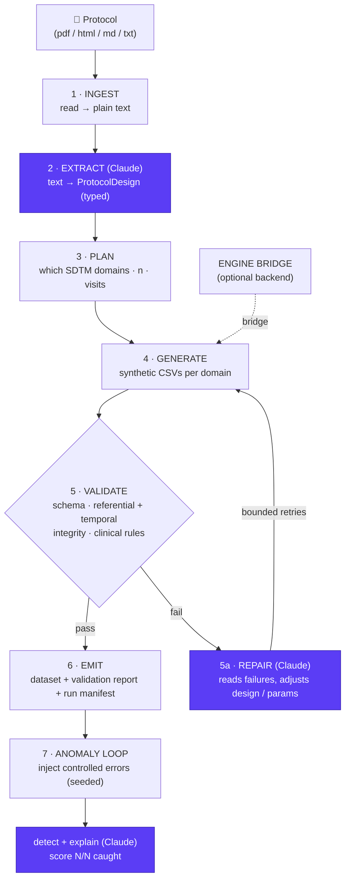

# Architecture

## The loop

## Components

| Module | Responsibility | Claude? |
|--------|----------------|---------|
| `src/protocol_to_data/ingest.py` | Load pdf/html/md/txt → normalized text (+ PHI-sanitizer injection point) | no |
| `src/protocol_to_data/extract.py` | Text → `ProtocolDesign`, with SHA-256 semantic cache + defensive JSON parsing | **yes** |
| `src/protocol_to_data/schemas.py` | Typed models (`ProtocolDesign`, `Arm`, `Visit`, `Endpoint`, `DomainPlan`) | no |
| `src/protocol_to_data/generate.py` | `ProtocolDesign` → per-domain CSVs; therapeutic-area profiles, dictionary coding, referential/temporal integrity guard | no (0 LLM coupling) |
| `src/protocol_to_data/validate.py` | Schema + clinical-rule checks → `ValidationReport` | no (Claude reads report on repair) |
| `src/protocol_to_data/anomalies.py` | Inject controlled errors; Claude detects + scores | **yes (detect)** |
| `src/protocol_to_data/loop.py` | Orchestrates 1–7, handles repair retries | **yes (repair)** |
| `src/protocol_to_data/llm.py` | Claude API wrapper — model routing, structured output, token/cost tracking | **yes** |
| `src/protocol_to_data/history.py` | Snapshot each run → `runs/<timestamp>/` for restore | no |
| `src/protocol_to_data/rbac.py` | RBAC injection-point stubs (Clinical Data Manager write / Statistician read) | no |
| `cli.py` | `ptd run/extract/generate/validate/anomalies` | no |
| `app.py` | Gradio web UI — upload → live narrated loop → data browser + scorecard + cost badge | no |

## Data contracts

- **Input**: any protocol as pdf/html/md/txt.
- **Intermediate**: `ProtocolDesign` (JSON-serializable, see `schemas.py`).
- **Output**: `data/output/<STUDY>/synthetic_data/*.csv` (one CSV per SDTM domain)
  + `validation_report.json` + `run_manifest.json`.

## Generation backends

`generate.py` supports two backends selected by config/flag:

1. **`builtin`** (default, in-repo): a lean, dependency-light, **therapeutic-area-aware**
   generator that produces DM/VS/LB/QS/AE/EX (+ RS for oncology) with plausible clinical
   values. It picks a clinical profile from the design's indication — a **cardiology**
   default (NT-proBNP/KCCQ/NYHA) and an **oncology** profile (NSCLC lab panel + PK,
   QLQ-C30/LC13 + EQ-5D-5L, arm-exact dosing, RECIST response) — so the same loop generates
   indication-appropriate data. Good enough to demo the loop across therapeutic areas.
2. **`engine-bridge`** (optional): shells out to the author's production engine
   (`protocol-synthetic-data-generation/scripts/engine.py`) for full 32-domain,
   clinically-rich output. Marked `ENGINE BRIDGE` in code; **not required** for the demo.

> Keeping `builtin` as default means the repo runs standalone for judges with just
> `pip install -r requirements.txt` + an API key — no access to the private engine needed.

## Reproducibility

- Every run takes `--seed`; the same (protocol, seed, subjects) → identical output.
- `run_manifest.json` records: protocol hash, design, seed, model id, timestamps, backend.

## Why the loop, not a pipeline

A straight pipeline breaks on the first messy protocol. The **repair edge** is what
makes it robust and what makes it a *Claude* project: validation failures feed back
into Claude, which adjusts the design (e.g. "AEs generated before first dose → move
AE onset window after RFSTDTC") and regenerates. This mirrors how a data manager
iterates, compressed into seconds.
