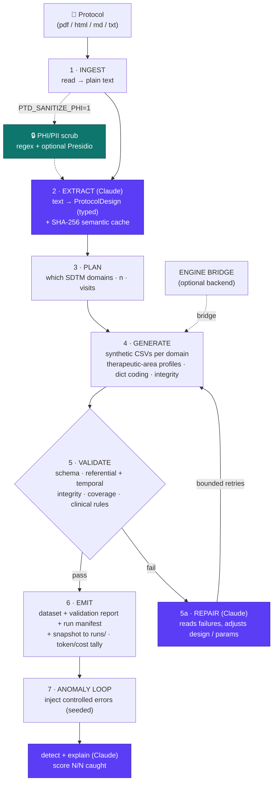
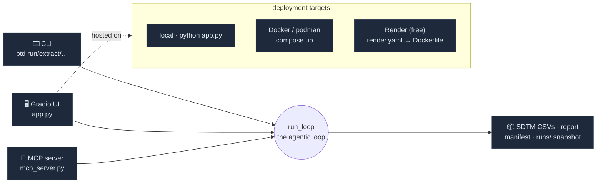

# Architecture

## The loop

> Purple = Claude-driven reasoning (extract · repair · detect). Teal = opt-in PHI scrub
> (off by default). Everything else is deterministic Python.

## Components

| Module | Responsibility | Claude? |
|--------|----------------|---------|
| `src/protocol_to_data/ingest.py` | Load pdf/html/md/txt → normalized text (PHI-sanitizer injection point) | no |
| `src/protocol_to_data/download.py` | Fetch a remote protocol URL → secure temp file (curl_cffi browser-TLS + urllib fallback); caller cleans up | no |
| `src/protocol_to_data/sanitize.py` | Opt-in PHI/PII scrub (`PTD_SANITIZE_PHI=1`): regex + optional Presidio NER, before Claude sees text | no |
| `src/protocol_to_data/extract.py` | Text → `ProtocolDesign`, with SHA-256 semantic cache + defensive JSON parsing | **yes** |
| `src/protocol_to_data/schemas.py` | Typed models (`ProtocolDesign`, `Arm`, `Visit`, `Endpoint`, `DomainPlan`) | no |
| `src/protocol_to_data/generate.py` | `ProtocolDesign` → per-domain CSVs; therapeutic-area profiles, dictionary coding, referential/temporal integrity guard | no (0 LLM coupling) |
| `src/protocol_to_data/validate.py` | Schema + clinical-rule checks → `ValidationReport` | no (Claude reads report on repair) |
| `src/protocol_to_data/anomalies.py` | Inject controlled errors; Claude detects + scores | **yes (detect)** |
| `src/protocol_to_data/loop.py` | Orchestrates 1–7, handles repair retries | **yes (repair)** |
| `src/protocol_to_data/llm.py` | Claude API wrapper — model routing, structured output, token/cost tracking | **yes** |
| `src/protocol_to_data/history.py` | Snapshot each run → `runs/<timestamp>/` for restore | no |
| `src/protocol_to_data/rbac.py` | RBAC injection-point stubs (Clinical Data Manager write / Statistician read) | no |
| `src/protocol_to_data/ctg_validator.py` | Read-only ClinicalTrials.gov v2 fetch for the Registry Cross-Check (phase / arms / enrollment); display-only, never feeds generation | no |
| `src/protocol_to_data/copilot.py` | Data Copilot — NL→DuckDB-SQL over the on-disk CSVs (memory-safe) + result→NL answer or a Plotly chart | **yes (SQL + answer)** |
| `cli.py` | `ptd run/extract/generate/validate/anomalies` | no |
| `app.py` | Gradio web UI (⚙️ Pipeline + 💬 Data Copilot tabs, ⬇ Download-ZIP button); zero-click NCT cross-check; clean API endpoints (`generate_synthetic_data` → JSON, `download_synthetic_data` → ZIP; protocol via upload/URL/sample); link-preview + `$PORT` handling | no |
| `mcp_server.py` | FastMCP server exposing `extract_protocol_design` / `generate_sdtm_dataset` / `validate_sdtm_dataset` as MCP tools | **yes (extract)** |

## Surfaces & deployment

The same loop is reachable three ways, and ships as a container for cloud hosting:

- **Local:** `python app.py` (binds `127.0.0.1:7860`) or the `ptd` CLI.
- **Container:** `docker compose up` / `podman-compose up` — `Dockerfile` runs non-root and binds
  `0.0.0.0` via `GRADIO_SERVER_NAME`.
- **Cloud:** the [`render.yaml`](../render.yaml) blueprint deploys the same image on Render's free
  tier — live at **https://protocol-to-data.onrender.com**. `app.py` honors a platform-assigned
  `$PORT` (precedence `PORT > GRADIO_SERVER_PORT > 7860`; see `_resolve_host` / `_resolve_port`),
  so it also runs unchanged on Railway / Fly / Cloud Run. `ANTHROPIC_API_KEY` is injected as a
  host secret, never baked into the image. Full guide: [`DEPLOY.md`](DEPLOY.md).

## Post-generation surfaces (read-only over the produced data)

Two subsystems sit *after* the loop and never influence generation:

- **Data Copilot (`copilot.py`).** A memory-safe NL analytics layer: Claude turns a question +
  the CSV schema into a **DuckDB** SQL query, which runs **directly on the on-disk CSVs**
  (`read_csv_auto`, streamed — never a `pd.read_parquet`/full-file load), capped at
  `memory_limit='256MB'`. A chart request builds a Plotly figure from the small (≤50-row) result;
  otherwise the result snippet goes back to Claude for a concise answer. Demo guardrails
  (≤150 chars, 3 queries/run, SQL-error safety net) live in `app.py`'s `copilot_respond`.
- **Registry Cross-Check (`ctg_validator.py`).** An NCT id is regex-detected from the extracted
  protocol text; the extracted design's phase / arm-count / enrollment are compared, **read-only**,
  against ClinicalTrials.gov v2 (fetched via `curl_cffi` to clear the registry's TLS-fingerprint
  WAF). A "verify before trust" badge — CTG data is display-only and never fed to generation.

## Data contracts

- **Input**: any protocol as pdf/html/md/txt.
- **Intermediate**: `ProtocolDesign` (JSON-serializable, see `schemas.py`).
- **Output**: `data/output/<STUDY>/synthetic_data/*.csv` (one CSV per SDTM domain)
  + `validation_report.json` + `run_manifest.json`.

## Generation backends

`generate.py` supports two backends selected by config/flag:

1. **`builtin`** (default, in-repo): a lean, dependency-light, **therapeutic-area-aware**
   generator that produces DM/VS/LB/QS/AE/EX (+ RS for oncology) with plausible clinical
   values. It picks a clinical profile from the design's indication — a **cardiology**
   default (NT-proBNP/KCCQ/NYHA) and an **oncology** profile (NSCLC lab panel + PK,
   QLQ-C30/LC13 + EQ-5D-5L, arm-exact dosing, RECIST response) — so the same loop generates
   indication-appropriate data. Good enough to demo the loop across therapeutic areas.
2. **`engine-bridge`** (optional): shells out to the author's production engine
   (`protocol-synthetic-data-generation/scripts/engine.py`) for full 32-domain,
   clinically-rich output. Marked `ENGINE BRIDGE` in code; **not required** for the demo.

> Keeping `builtin` as default means the repo runs standalone for judges with just
> `pip install -r requirements.txt` + an API key — no access to the private engine needed.

## Reproducibility

- Every run takes `--seed`; the same (protocol, seed, subjects) → identical output.
- `run_manifest.json` records: protocol hash, design, seed, model id, timestamps, backend.

## Why the loop, not a pipeline

A straight pipeline breaks on the first messy protocol. The **repair edge** is what
makes it robust and what makes it a *Claude* project: validation failures feed back
into Claude, which adjusts the design (e.g. "AEs generated before first dose → move
AE onset window after RFSTDTC") and regenerates. This mirrors how a data manager
iterates, compressed into seconds.
